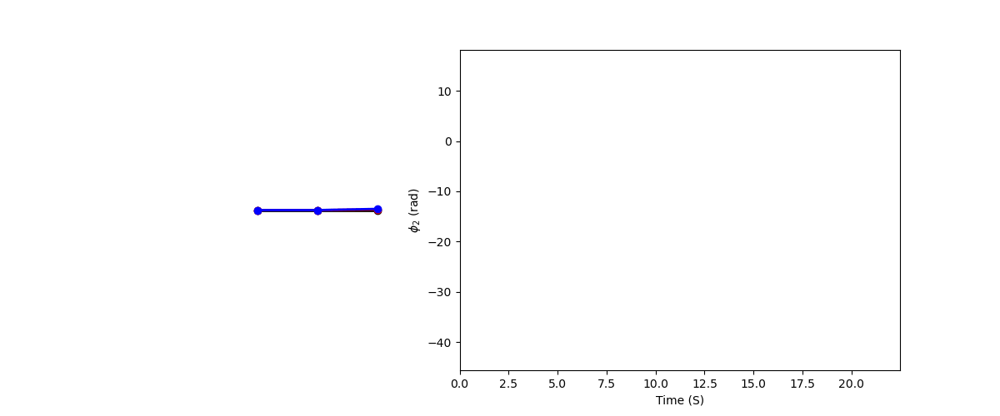
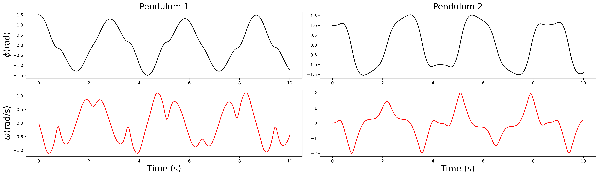
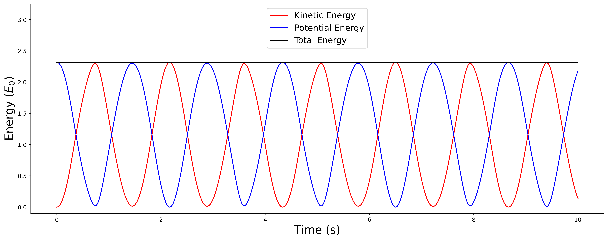
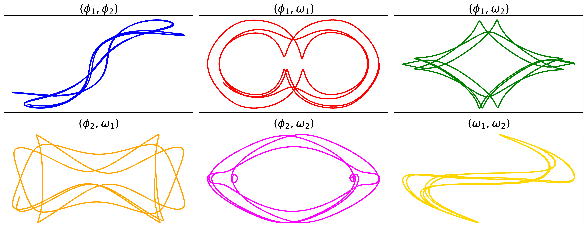

# TU Delft Computational Physics Project 3: Study of Chaos in the Double Pendulum
## Authors: Kyproula Mitsidi, Konstantinos Pourgourides

Welcome to our project! We simulate the dynamics of a double pendulum using the RK4 algorithm and calculate various physical quantities and observables that give us an insight into chaos.

<p align="center">
  
</p>

## Load the necessary modules

Run this cell to load all the necessary modules

```python
import double_pendulum as dp
import animations as ani
```

## Initialize Pendulums 

To fully determine the state of the double pendulum, you need to provide the initial angles and angular velocities. The masses and lengths are set to unity by default, but you can change them in the function arguments

```python
dp.initialize_first_body(phi_1=1.5, omega_1=0)
dp.initialize_second_body(phi_2=1,  omega_2=0)
```

## Run Simulation

choose a timestep `dt`, total number of timesteps `t_steps`, and run the simulation! The output is the full state vector

$$\mathbf{x}(t) =  (\phi_1(t),\ \phi_2(t),\ \omega_1(t),\ \omega_2(t))^T$$

```python
dt = 1e-4
t_steps = int(10/dt) #10 second simulation
phi1, phi2, w1, w2 = dp.simulate(dt, t_steps)
state_vector = [phi1, phi2, w1, w2]
```

## Plots

Run the cells below to plot:

- Time evolution of state variables
- Time evolution of kinetic, potential and total energy
- All the phase space projections


```python
dp.plot_state_vector(*state_vector, dt, t_steps)
```

<p align="center">
  
</p>


```python
dp.plot_energies(*state_vector, dt, t_steps)
```

<p align="center">
  
</p>

```python
dp.plot_phasespace_projections(*state_vector)
```

<p align="center">
  
</p>

