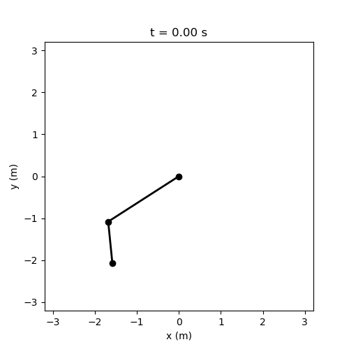
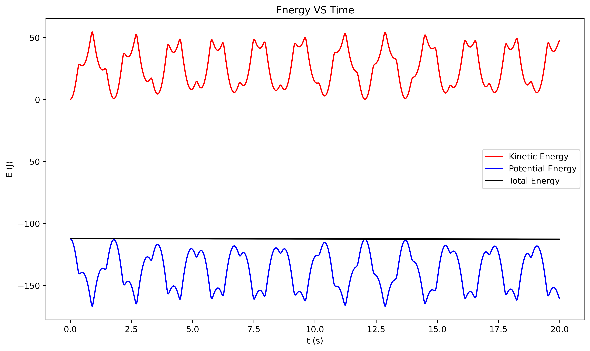
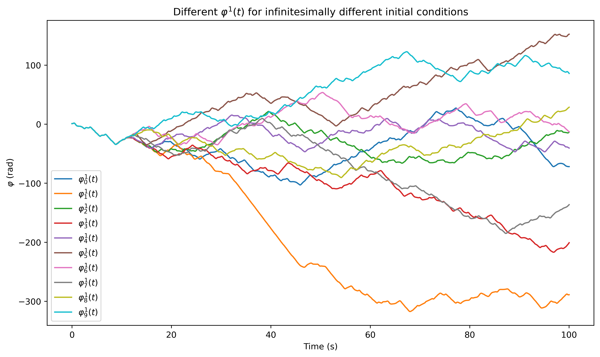
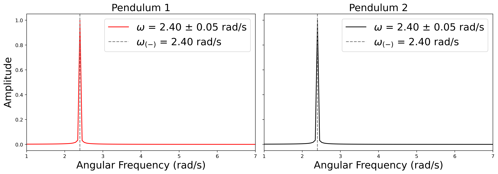
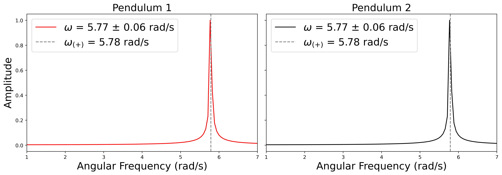
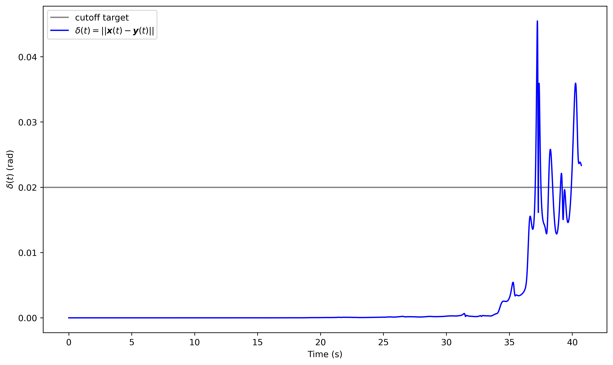
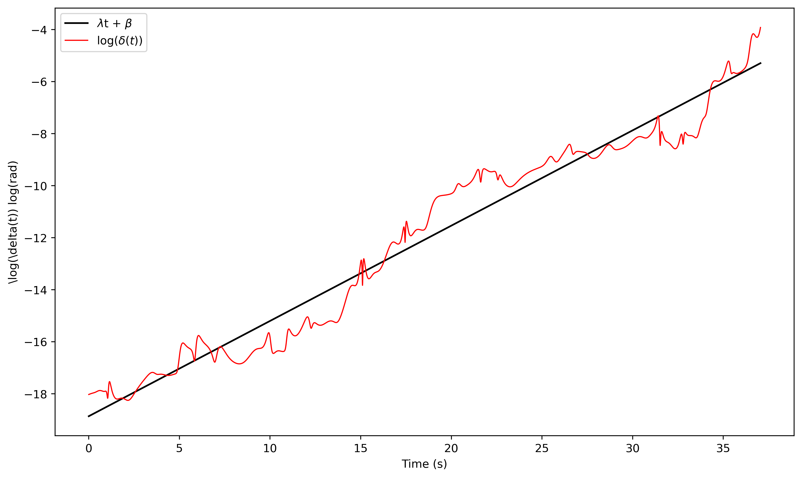
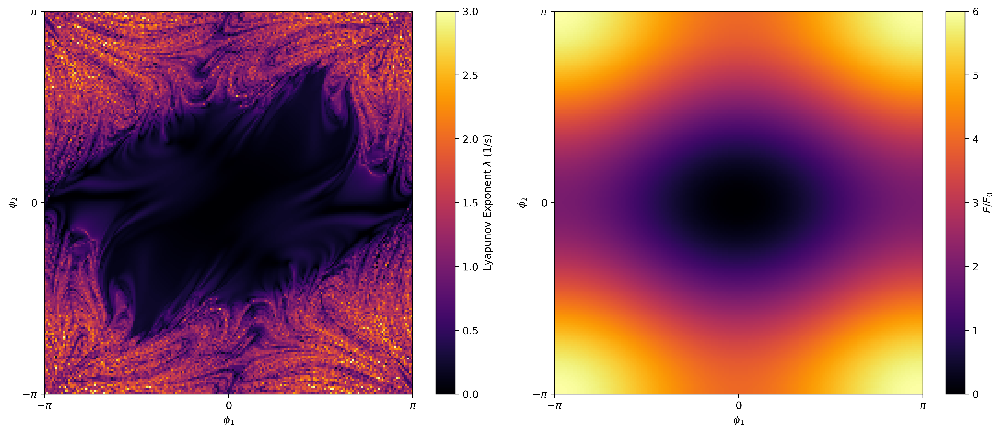
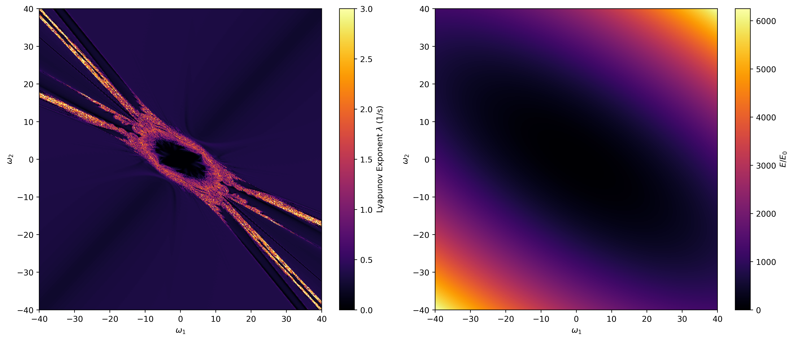

# Weekly progress journal

## Instructions

In this journal you will document your progress of the project, making use of the weekly milestones.

Every week you should

1. write down **on the day of the lecture** a short plan (bullet list is sufficient) of how you want to
   reach the weekly milestones. Think about how to distribute work in the group,
   what pieces of code functionality need to be implemented.
2. write about your progress **until Monday, 23:59** before the next lecture with respect to the milestones.
   Substantiate your progress with links to code, pictures or test results. Reflect on the
   relation to your original plan.

We will give feedback on your progress on Tuesday before the following lecture. Consult the
[grading scheme](https://computationalphysics.quantumtinkerer.tudelft.nl/proj3-grading/)
for details how the journal enters your grade.

Note that the file format of the journal is *markdown*. This is a flexible and easy method of
converting text to HTML.
Documentation of the syntax of markdown can be found
[here](https://docs.gitlab.com/ee/user/markdown.html#gfm-extends-standard-markdown).
You will find how to include [links](https://docs.gitlab.com/ee/user/markdown.html#links) and
[images](https://docs.gitlab.com/ee/user/markdown.html#images) particularly.

## Week 1 - planning the project
(due Wednesday, 20 May 2026, 23:59)

Discussions about the project design are best done in person with the course team or via the planning issue #1. Once your project is approved, copy the project plan here.

### Project Plan

> [!NOTE]
> Below you can find our initial project plan:
    
We would like to work on making a numerical simulation of the double pendulum. Computationally-wise, this will mainly revolve around the numerical solution of the equations of motion since they dont have closed form solution, using a technique like Verlet's algorithm or Runge-Kutta. We could possibly study the following things:

- Study and quantify the chaotic behavior of the system (sensivity to initial conditions) by calculating Lyapunov exponents.

- Display the chaotic trajectories in phase space and Poincare sections

- Study energy conservation in such system

- Investigate how the pendulum masses, lengths, and external driving or damping forces influence the things mentioned in previous points

- Study normal modes of the oscillations using Fourier Transforms

- Study small angle approximation, for which the system has an analytical solution and compare the results to the expected trajectories.

> [!WARNING]
> The information we could find on this topic is mostly pedagogical, since its a classical mechanics system, and not much research is published on it (at least the simple double pendulum). So, we don't have a plethora of research results to compare our study with. Most publications on this subject are from student reports or simple (numerical) experiments. Nevertheless, we believe that it can be a cool final project since it has a lot of computational value and touches on interesting topics.
Below we cite some of the sources we found:

- Levien, R. B., & Tan, S. M. (1993). Double pendulum: An experiment in chaos. American Journal of Physics, 61(11), 1038–1044. https://doi.org/10.1119/1.17335

- Deleanu, D. (2011). The dynamics of a double pendulum: Classic and modern approach. Annals of “Dunarea de Jos” University of Galati, Fascicle II: Mathematics, Physics, Theoretical Mechanics, 3.

- Cabrera, S., Leonel, E. D., & Martí, A. (2023). Regular and chaotic phase space fraction in the double pendulum. arXiv preprint arXiv:2312.13436. https://doi.org/10.48550/arXiv.2312.13436

- Stachowiak, T., & Okada, T. (2006). A numerical analysis of chaos in the double pendulum. Chaos, Solitons & Fractals, 29(2), 417–422. https://doi.org/10.1016/j.chaos.2005.08.032

- **classical mechanics textbooks**

**This project plan was approved by Prof. Anton Akhmerov on May 13th** [see here](https://gitlab.kwant-project.org/computational_physics/projects/Project3_kmitsidi_kpourgourides/-/work_items/1).

## Week 2
(due Monday, 25 May 2026, 23:59)

### Milestone Plan 

- [ ] Initialization of the system

We plan to make functions that initialize the two pendulums through user inputs. To fully determine the system, each pendulum will need an initial angle and angluar velocity, as well as physical characteristics such as mass and rod length. 

- [ ] Time evolution of the system

We plan to make a function that handles the time evolution of the system iteratively, starting from the initial conditions provided in the previous function.

- [ ] Calculation of Energy

We plan to make two functions to calculate the kinetic and potential energy of the double pendulum based on the angles and angular velocities after the time evolution.

- [ ] Validation Check

We plan to check the conservation of energy during the time evolution of the double pendulum and see whether it is conserved or not, validating our time evolution procedure.

- [ ] Observation of Chaos

We plan to plot multiple trajectories of one of the pendulums for nearly identical initial conditions and observe how they diverge as the system evolves. This is a signature characteristic of chaos, namely the large sensitivity of the system on initial conditions.

### Milestone Progress

- [X] Initialization of the system

We created two functions, one for the initialization of each pendulum. User input provides the initial angle $\phi$ (rad) and angular velocity $\omega$ (rad/s) of each pendulum in the system, as well as their mass $m$ (kg) and length $\ell$ (m), which are then saved as global variables in the simulation.

> [!NOTE]
> You can find the initialization functions [here](https://gitlab.kwant-project.org/computational_physics/projects/Project3_kmitsidi_kpourgourides/-/blob/405f1104e593806d267dfc32976babebc0257f9c/double_pendulum.py#L15-32).

> [!IMPORTANT]
> Assumptions: Two point masses connected by rigid, massless rods, moving under gravity in the x-y plane. No external forces or damping is applied at this point.

- [X] Time evolution of the system

We created a function that handles the time evolution of the system by solving the equation of motion for each pendulum through the velocity-Verlet algorithm. For the algorithm, we needed the forces (and hence the angular accelerations), which were handled in a separate function due to their [big formulas](https://en.wikipedia.org/wiki/Double_pendulum). 

Below you can see the evolution of the system as an animation for the following (random) parameters

Pendulum 1: $$\{m=1kg,\ \ell=2m,\ \phi(0)=-1\text{ rad},\ \omega(0)=0 \text{ rad/s}\}$$
Pendulum 2: $$\{m=5kg,\ \ell=1m,\ \phi(0)=0.1 \text{ rad},\ \omega(0)=-0.25 \text{ rad/s}\}$$

     
> [!NOTE]
> You can find our time evolution function [here](https://gitlab.kwant-project.org/computational_physics/projects/Project3_kmitsidi_kpourgourides/-/blob/405f1104e593806d267dfc32976babebc0257f9c/double_pendulum.py#L64-98), and our angular acceleration function [here](https://gitlab.kwant-project.org/computational_physics/projects/Project3_kmitsidi_kpourgourides/-/blob/405f1104e593806d267dfc32976babebc0257f9c/double_pendulum.py#L35-61).

- [X] Calculation of Energy

We created two functions for the calculation of the kinetic and potential energy given the angles $\phi_1,\phi_2$ and angular velocities $\omega_1, \omega_2$ respectively.

> [!NOTE]
> You can find our energy functions [here](https://gitlab.kwant-project.org/computational_physics/projects/Project3_kmitsidi_kpourgourides/-/blob/405f1104e593806d267dfc32976babebc0257f9c/double_pendulum.py#L101-116).

- [X] Validation Check

To validate the time evolution procedure, we investigated the conservation of energy for the first 20 seconds of the same run as previously

Evidently, the total energy of the system is conserved over time, validating our implementation. The well observed energy conservation is characteristic of the velocity-Verlet algorithm, which is a symplectic integrator. In the following weeks, we aim to investigate different phenomena in more detail.

- [X] Observation of Chaos

We made 10  100-second runs of the double pendulum while always initiating the upper pendulum with the same initial conditions, and changing the initial angle of the lower pendulum by $1\times10^{-6}$ rad each time

As shown above, we indeed observe the trajectories being almost identical for the first ~10 seconds of the time evolution, after which they unpredictably diverge from each other. This is a signature characteristic of chaos.

### AI Disclosure

- We used `chatGPT` to help us create the animation as we envisioned it. All implemented ideas are our own.

## Week 3
(due Monday, 01 June 2026, 23:59)

### Milestone Plan 

- [ ] Investigate the time evolution algorithm

We had initially implemented the velocity-Verlet algorithm for our simulation, but as per the TA's (Efe) suggestion, we will also investigate a higher order method, and see whether it is a better fit for the purpose of our project.

- [ ] Validity test: Low energy oscillations

In the limit of low energies (small initial angles and angular velocity), we expect the system to act as two coupled oscillators. The system then admits two natural frequencies, one for the pendulums moving in phase ($\phi_1 = \phi_2$) and out of phase ($\phi_1 = -\phi_2$). We aim to observe the system performing such oscillations to confirm its reliability in the low energy regime, where we can still have some predictability.

- [ ] Quantify Chaos through Lyapunov exponents

We aim to quantify chaoticity through Lyapunov exponents. We will explore how to calculate this quantity, and then scan regions of position space $(\phi_1, \phi_2)$ and momentum space $(\omega_1, \omega_2)$ and create heatmaps of the Lyapunov exponents to map the regions with the lowest/highest chaos in the system.

### Milestone Progress

- [X] Investigate the time evolution algorithm

As per the TA's suggestion, we investigated the application of a higher order method (RK4), and concluded that it is indeed a better fit for our project. The RK4 method introduces an error $\mathcal{O}(dt^4)$ instead of Verlet's $\mathcal{O}(dt^2)$, which is an important gain in a chaotic system where trajectories oftentime evolve in erratic ways. It is crucial to have an accurate trajectory integration such that our sensitive study of Lyapunov exponents is as accurate as possible. As we discussed in the [report](https://github.com/KPourgourides/Molecular-Dynamics-Simulation-of-Argon/blob/main/report/REPORT.pdf) of the first project (section 2.3.A), Verlet's algorithm is a symplectic integrator (conserves phase-space volume), resulting in more accurate energy conservation than RK4 in the longterm, but since we are not interested in very long time-scale simulations, the trajectory accuracy aspect of the RK4 is more appropriate for our project.

> [!NOTE]
> You can find our implementation of the RK4 algorithm [here](https://gitlab.kwant-project.org/computational_physics/projects/Project3_kmitsidi_kpourgourides/-/blob/77120ede517d50a990692f03db3033486f7d3fcf/double_pendulum.py#L48-87).
> 
- [X] Validity test: Low energy oscillations

We calculated the in-phase and out-of-phase oscillation frequencies in the low energy regime, and checked whether low energy simulations oscillated close to these frequencies. The calculation was carried out as follows:

For $m_1 = m_2 = m$ and $\ell_1 = \ell_2 = \ell$ and small angles $\sin(\phi) \approx \phi$, $\cos(\phi) \approx 1$, the Lagrangian is

$$ \mathcal{L} = \frac{1}{2}\dot{\boldsymbol{q}}^T 
\boldsymbol{M}\dot{\boldsymbol{q}} - \frac{1}{2}\boldsymbol{q}^T 
\boldsymbol{K}\boldsymbol{q}$$

where

$$ \boldsymbol{q} = \begin{pmatrix} \phi_1 \\ \phi_2\end{pmatrix}$$

and

$$ \boldsymbol{M} = m\ell^2\begin{pmatrix} 2 & 1 \\ 1 & 1\end{pmatrix},
\quad \boldsymbol{K} = mg\ell \begin{pmatrix} 2 & 0 \\ 0 & 1\end{pmatrix}.$$

By applying the Euler-Lagrange equations for $\phi_{1,2}$, we get

$$\boldsymbol{M}\ddot{\boldsymbol{q}} + \boldsymbol{K}\boldsymbol{q} = 0;$$

assuming a normal mode ansatz $\boldsymbol{q}(t) = \boldsymbol{\alpha}e^{i\omega t}$, we get

$$(\boldsymbol{K} - \omega^2\boldsymbol{M})\boldsymbol{\alpha} = 0,$$

and the eigenfrequencies are given by

$$\det(\boldsymbol{K} - \omega^2\boldsymbol{M}) = 0
\Rightarrow \omega_{\pm} = \sqrt{\frac{g}{\ell}(2 \pm \sqrt{2})}. $$ 

For $\ell = 1$m and $g = 9.81 m/s^2$,

$$f_{+} \approx 0.92 \text{Hz (out-of-phase)}, \quad f_{-} \approx 0.38 \text{Hz (in-phase)}. $$

We run several simulations with in-phase and out-of-phase initial angles $(\phi_1, \phi_2) \in [0, 1.4]$ rad ($\omega_1(0) = \omega_2(0) = 0 $ rad/s) covering the low and intermediate energy regimes, and performed fast fourier transforms to extract the principal frequencies of motion. The results are depicted below 

     
Evidently, for very low energies out-of-phase and in-phase oscillations mostly occupy the modes $\omega_{\pm}$ respectively, which is consistent with out theoretical prediction. Indeed, as we move out of the low energy regime, trajectories become more chaotic and occupy a wide range of frequency modes with different amplitudes, instead of just $\omega_{\pm}$.

- [X] Quantify Chaos through Lyapunov exponents

Chaos is often defined as the sensitivity of a system with respect to infinitesimal changes in initial conditions. Assume that we have two initial states of the double pendulum $\boldsymbol{x,y}$ separated by an infinitesimally small perturbation $\boldsymbol{\varepsilon}$:

$$\boldsymbol{x}_0 = \begin{pmatrix} \phi_1(0) \\ \omega_1(0) \\ \phi_2(0) \\ \omega_2(0)\end{pmatrix}$$
$$\boldsymbol{y}_0 = \boldsymbol{x}_0 + \boldsymbol\varepsilon,$$

If the system is chaotic, it is expected that the phase-space distance $\delta = ||\boldsymbol{x} - \boldsymbol{y}||$ of these trajectories will diverge exponentially in time

$$\delta(t) \approx \delta_0e^{\lambda t}.$$

Where $\lambda$ is the **Lyapunov Exponent**. For our system, we expect values $\lambda \approx 0$ for low energies, with $\lambda$ growing as we explore more chaotic scenarios. As we will see later, $\lambda$ is not monotonic with energy.

To calculate $\lambda$, we log both sides

$$\log(\delta) = \lambda t + \log(\delta_0) $$

and fit a linear line. The slope is the Lyapunov exponent $\lambda$. This method is described in Taylor's Classical Mechanics textbook.

*Note 1*: The phase-space distance $\delta(t)$ is calculated until it has reached a certain threshold $\delta(t) \leq \Delta$, for which the Lyapunov formula holds. In our case, we set the threshold for 1 rad.

*Note 2*: The phase-space distance $\delta(t)$ is given by

$$\delta(t) = \sqrt{(\phi_{1_x}-\phi_{1_y})^2 + (\omega_{1_x}-\omega_{1_y})^2 + (\phi_{2_x}-\phi_{2_y})^2 + (\omega_{2_x}-\omega_{2_y})^2} $$

Of course, $\phi$ and $\omega$ have different units, but in our simulation we implement natural units such that the two quantities have the same units (rad), and this phase-space distance is meaningful.

Below, we present an example of this procedure in which the lyapunov exponent was calculated to be $\lambda \approx 0.36$

> [!NOTE]
> You can find the code implementation of the Lyapunov exponent calculation [here](https://gitlab.kwant-project.org/computational_physics/projects/Project3_kmitsidi_kpourgourides/-/blob/b3427116f2aad114edc5934236842efb166996f5/double_pendulum.py#L110-160).

To investigate when the system transitions to chaotic behaviour, we first consider the case where both pendulums are released from rest and vary only their initial angles. In this scenario, the total energy is entirely determined by the system's potential energy, since the initial kinetic energy is zero. Because the potential energy is bounded, this scan is restricted to the low-energy regime. The resulting scans are shown below

The right plot displays the total energy associated with each initial condition, while the left shows the corresponding Lyapunov exponents.

For small initial-angle combinations, the system exhibits predominantly quasiperiodic motion, characterized by Lyapunov exponents close to zero. As the initial angles increase, the system gradually transitions into a chaotic regime, reflected by larger positive Lyapunov exponents. Comparing the two plots reveals a clear overall trend: higher-energy initial conditions generally correspond to larger Lyapunov exponents and therefore stronger chaotic behaviour.

Despite having the same energy along certain directions, the system displays slightly different dynamics depending on the relative phase of the pendulums. When the pendulums start in phase $(\phi_1 = \phi_2)$, the chaos occurs at larger initial angles. Conversely, when they start out of phase $(\phi_1 = -\phi_2)$, chaotic behaviour emerges at lower angles, indicating that out-of-phase configurations are more prone to chaotic motion.

We also wanted to investigate the system transitions when we release it with a variety of initial velocities, when both pendulums are hanging down $(\phi_1 = \phi_2 = 0)$. This lets us explore a broader energy spectrum. The resulting scans are shown below

the right plot displays the total energy associated with each initial condition, while the left shows the corresponding Lyapunov exponents.

These plots provide additional insight into the relationship between energy and chaotic behaviour. For small initial velocities, the system remains in a quasiperiodic regime, characterized by Lyapunov exponents close to zero. As the velocities increase, the total energy rises and the system enters a chaotic regime, indicated by positive Lyapunov exponents.
Unlike the angle scans, however, increasing the energy does not lead to a monotonic increase in chaos. Although the energy continues to grow in all directions of the velocity space, the chaotic region is bounded, and quasiperiodic behaviour reappears at higher energies for certain initial conditions. This demonstrates that chaos is not determined solely by the total energy, but also by how that energy is distributed between the two pendulums.

A particularly striking feature appears along the in-phase direction $(\omega_1 = \omega_2)$, where a distinct low-chaos band is visible. Along this line, the Lyapunov exponent remains close to zero. As the energy increases along this direction, the system briefly enters a chaotic regime before returning to quasiperiodic behavior at larger velocities.
In contrast, along the out-of-phase direction ($\omega_1 = -\omega_2$), the chaotic regime persists throughout the explored velocity range, after exiting the quasiperiodic regime, further supporting the observation that out-of-phase configurations are more prone to chaotic motion.
More generally, the Lyapunov map reveals several structured bands and lines associated with enhanced or suppressed chaos for specific combinations of initial velocities. 

Understanding the origin of these features will be the focus of the following week and the presentation.

### AI Disclosure

- We did not use AI for the milestones of this week.

## Reminder final deadline

The deadline for project 3 is **Monday, 08 June 2026, 23:59**. By then, you must have uploaded the presentation slides to the repository, and the repository must contain the latest version of the code.